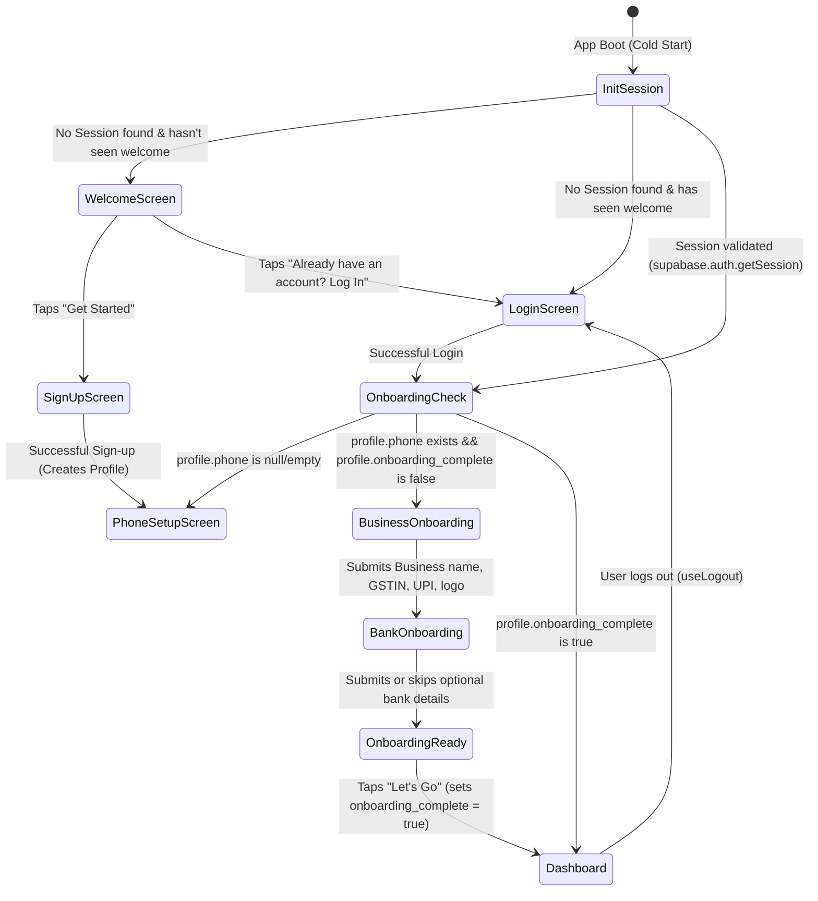
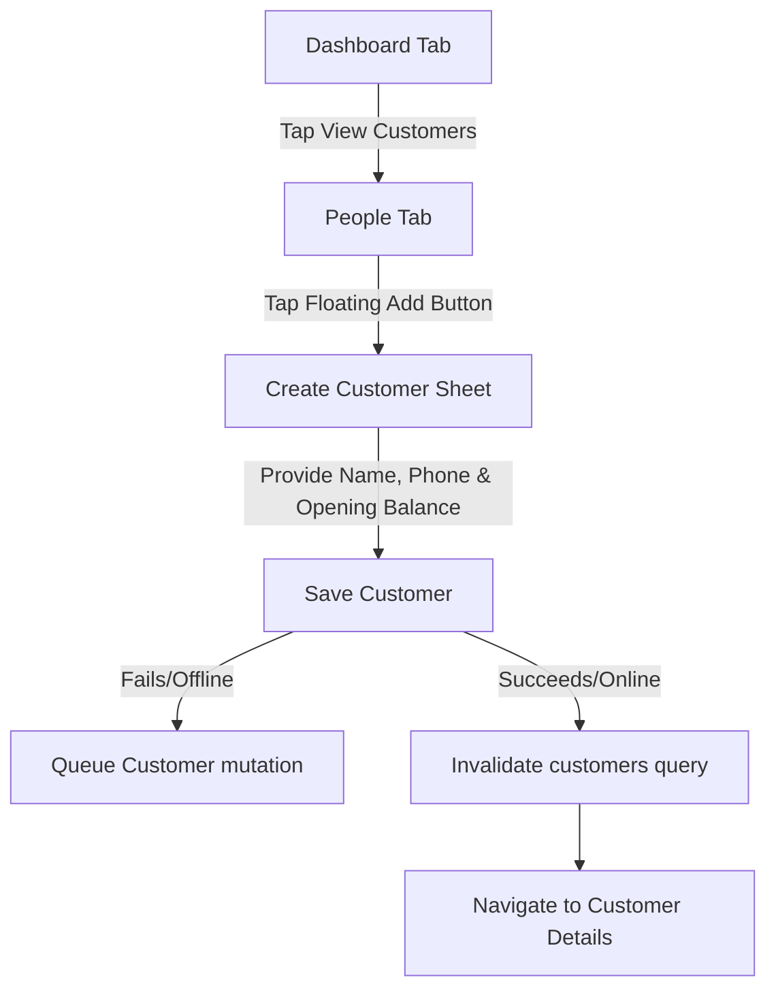
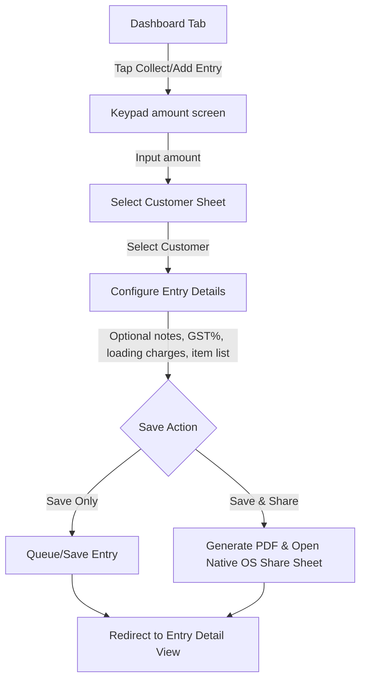
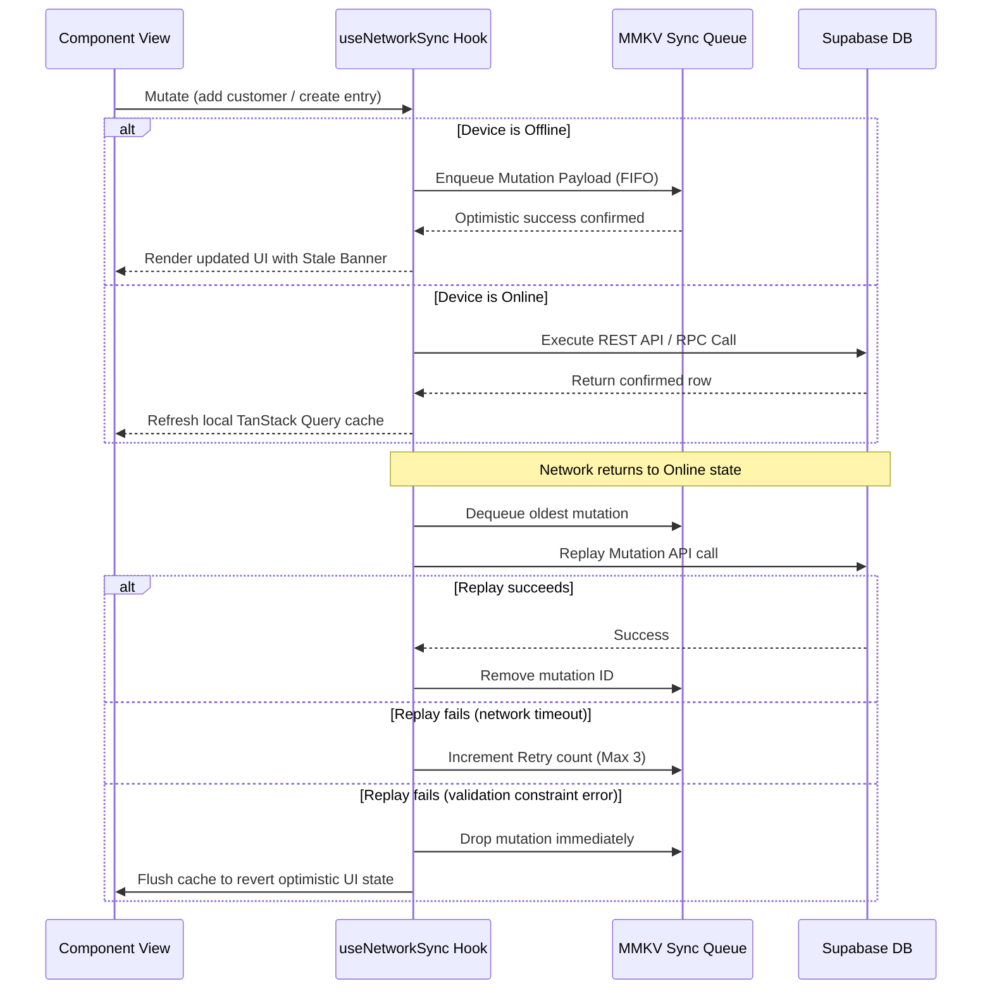

# KredBook Application User Journeys & Screen Flow Specification

This document maps out every user journey, route guard redirection, and interactive state transition within KredBook. It is written to serve as a complete reference for human developers and AI coding agents.

---

## 1. Application Routing & Authentication State Machine

The routing structure in KredBook is file-based and managed by Expo Router under the [app/](file:///c:/Users/Subrat/OneDrive/Desktop/kredBook/app/) folder. Redirection and route guards are configured globally in [app/_layout.tsx](file:///c:/Users/Subrat/OneDrive/Desktop/kredBook/app/_layout.tsx) based on the session details stored in `useAuthStore` ([src/store/authStore.ts](file:///c:/Users/Subrat/OneDrive/Desktop/kredBook/src/store/authStore.ts)).

### Dynamic Routing State Diagram

---

## 2. Global Guard Redirection Matrix

Redirection constraints are checked inside [app/_layout.tsx](file:///c:/Users/Subrat/OneDrive/Desktop/kredBook/app/_layout.tsx#L110) on every change to the authenticated user and profile state:

| Authentication State | Profile State (`profiles` table) | Target Path Category | Resulting Path Redirect | Key File & Hook Reference |
| :--- | :--- | :--- | :--- | :--- |
| **Recovery Mode** | N/A | Any path | `/(auth)/set-new-password` | [useAuth.ts](file:///c:/Users/Subrat/OneDrive/Desktop/kredBook/src/hooks/useAuth.ts) |
| **Unauthenticated** | N/A | `/(main)/*` (Tabs) | `/(auth)/login` or `/` | [app/index.tsx](file:///c:/Users/Subrat/OneDrive/Desktop/kredBook/app/index.tsx) |
| **Authenticated** | Missing Profile row | Any path | `/profile-error` | [app/profile-error.tsx](file:///c:/Users/Subrat/OneDrive/Desktop/kredBook/app/profile-error.tsx) |
| **Authenticated** | `phone` is null/empty | Any path | `/(auth)/phone-setup` | [phone-setup.tsx](file:///c:/Users/Subrat/OneDrive/Desktop/kredBook/app/(auth)/phone-setup.tsx) |
| **Authenticated** | `onboarding_complete` = false | Any path | `/(auth)/onboarding/business` | [business.tsx](file:///c:/Users/Subrat/OneDrive/Desktop/kredBook/app/(auth)/onboarding/business.tsx) |
| **Authenticated** | `onboarding_complete` = true | `/(auth)/*` or `/` | `/(main)/dashboard` | [app/_layout.tsx](file:///c:/Users/Subrat/OneDrive/Desktop/kredBook/app/_layout.tsx) |
| **Public Link** | N/A | `/l/[token]` | No Redirect (Bypasses all guards) | [app/l/[token].tsx](file:///c:/Users/Subrat/OneDrive/Desktop/kredBook/app/l/[token].tsx) |

---

## 3. Core User Journeys (Step-by-Step UI Actions)

### 3.1. Sign Up & Onboarding Flow
1. **Welcome/Landing Screen**:
   - Renders product tagline and three feature badges: "Fast Entry", "Always Visible", "Works Offline".
   - Tapping **Get Started** sets `hasSeenWelcome = true` in local AsyncStorage and pushes route to `/(auth)/signup`.
2. **Signup Screen** (`app/(auth)/signup.tsx`):
   - Merchant provides Email, Password, and Full Name.
   - Submitting triggers `signUpApi`.
   - **Side Effect**: Supabase Auth registers the user; a database trigger automatically inserts a matching row into `public.profiles`.
   - On success, routes user to `/(auth)/phone-setup`.
3. **Phone Setup Screen** (`app/(auth)/phone-setup.tsx`):
   - Merchant enters a 10-digit Indian phone number.
   - Form validates that the input starts with appropriate mobile digits.
   - Submitting updates the `profiles.phone` column and routes to the onboarding stack.
4. **Onboarding: Business Setup** (`app/(auth)/onboarding/business.tsx`):
   - Merchant enters Business Name (required), optional GSTIN, and UPI ID (for collections).
   - Tapping logo uploads an image to the `business-logos` Supabase bucket under `logos/${vendorId}/logo.${fileExt}`.
   - Pushes route to `/(auth)/onboarding/bank`.
5. **Onboarding: Bank Details** (`app/(auth)/onboarding/bank.tsx`):
   - Merchant can optionally provide Bank Name, Account Number, and IFSC Code.
   - Tapping **Skip** or **Continue** pushes to `/(auth)/onboarding/ready`.
6. **Onboarding: Ready Screen** (`app/(auth)/onboarding/ready.tsx`):
   - Welcomes the user with a celebratory illustration.
   - Request system notification permissions for overdue reminders.
     - If allowed: triggers `ensureNotificationPermission()`.
     - If denied: updates preference store flags quietly.
   - Tapping **Let's Go** updates `profiles.onboarding_complete = true` in the database, triggering the root layout listener to redirect the merchant to `/(main)/dashboard`.

---

### 3.2. Customer (People) Management Flow

1. **Customer List View** (`app/(main)/people/index.tsx`):
   - Displays a Shopify `FlashList` of customers showing their name, avatar (cycling colors deterministically), outstanding balance, and last transaction date.
   - **Empty State**: Renders a placeholder illustration if no customers exist, guiding the user to "Add Customer".
   - **Search Input**: Triggers a local case-insensitive filter over the customer list by name or phone.
   - **Filter Actions**: Sort alphabetically, by newest created, or by outstanding amount (high to low / low to high).
2. **Create Customer Screen** (`app/(main)/people/create.tsx`):
   - Form inputs: Name (required), Phone, Address, UPI ID, and **Opening Balance** (for pre-existing credit).
   - Form validates phone number format. If the phone number is already registered under the same merchant, it prevents submission and shows: `"A person with this phone number already exists in your account."`
   - Tapping **Add Customer** invokes `addPerson()` API. If offline, the mutation is serialized and appended to the sync queue.
3. **Customer Detail View** (`app/(main)/people/[customerId]/index.tsx`):
   - Displays customer name, phone, and address.
   - **Summary Card**: Displays outstanding balance. Uses color gradients:
     - **Red/Rose** if the customer has overdue unpaid entries.
     - **Green** if the balance is fully settled (₹0.00).
     - **Blue** if the customer has an advance credit balance.
   - **Ledger Timeline**: Displays a chronological timeline of all entries (bills) and payments.
     - Entries display: Bill number, total amount, balance due, and due date.
     - Payments display: Amount, date, and payment mode.
     - **Reconciliation Check**: Runs a comparison between the sum of unpaid order balances and `parties.customer_balance`. If they diverge by > ₹0.01, it warns in development and surfaces an inline alert.
   - **Header Options**:
     - *Edit Profile*: Routes to `edit.tsx` to modify customer contact details.
     - *Delete Profile*: Invokes `deletePerson()` (queued if offline) and redirects back to customer list.
     - *Share Ledger*: Generates a public ledger access token, copies a pre-composed WhatsApp reminder, and launches the native share sheet.

---

### 3.3. Entry (Bill) Creation Flow

1. **Keypad Numpad View** (`app/(main)/entries/create.tsx`):
   - Merchant is presented with a large, dedicated numeric keypad to input the primary transactional amount.
   - Tapping **Continue** opens a bottom sheet customer selector.
2. **Customer Picker Bottom Sheet**:
   - Displays a dense scroll list of customers with search capabilities.
   - Tapping a customer anchors the transaction, shows their current outstanding balance, and transitions to the Entry Form.
3. **Entry Details Configuration**:
   - Merchant selects the transaction direction (defaults to credit extended).
   - **Invoice Details Accordion**:
     - Auto-generated sequential bill number (e.g. `INV-001`) retrieved from database RPC `get_next_bill_number` (falls back to date timestamp suffix `INV-timestamp` if offline).
     - Customized due-date chips (7 days, 15 days, 30 days, or custom calendar picker).
     - Optional notes.
   - **Itemized Bill Grid**:
     - Merchant can tap **Add Items** to add specific line item rows with quantity and rates.
     - Custom input fields compute item subtotals dynamically.
     - Add tax percentages (GST 5%, 12%, 18%) and loading charges.
4. **Save Commit Actions**:
   - **Save Only**: Inserts entry, items, and any initial payments atomically via RPC `create_order_transaction` (queued if offline).
   - **Save & Share**: Stages the database commit, compiles a PDF document locally via `expo-print` containing the merchant profile header, logo, customer name, and bill items table, and opens the native OS share sheet.
   - Pushes navigation path to the newly created Entry Detail view (`app/(main)/entries/[orderId]/index.tsx`).

---

### 3.4. Payment Collection Flow
1. **Record Payment Sheet** (`RecordPaymentModal`):
   - Triggered via **Collect** from the Dashboard priority list, Customer Detail bar, or Entry Detail.
   - Slides up a bottom sheet pre-filled with the outstanding balance.
2. **Intent Selection**:
   - **Full Payment**: Prefills the input amount field with the total outstanding balance. Button label becomes **Mark Fully Paid**.
   - **Partial Payment**: Displays a numeric keyboard allowing the merchant to input custom cash collected.
3. **Validation**:
   - **Overpay Validation**: Input amounts cannot exceed the outstanding balance due. If exceeded, the payment action button is disabled and displays: `"Amount cannot exceed ₹due"`.
4. **Payment Mode**:
   - Merchant selects payment mode tags: Cash, UPI, NEFT, Cheque. Can input optional receipt notes.
5. **Collection Commit**:
   - Tapping **Record Payment** writes to `public.payments`.
   - **Side Effect**: A database trigger (`on_payment_upsert`) automatically increments `orders.amount_paid` and updates `orders.status` (Pending -> Partially Paid -> Paid).
   - On confirmation, the sheet switches to a receipt state displaying a checkmark graphic, payment summary, and a **Share Receipt** WhatsApp shortcut.

---

### 3.5. Sharing & Exports Journeys
* **WhatsApp Text Reminder**:
  - Tapping **Remind** on Customer details or Entry details reads the customer name and balance.
  - Formats a message: `Hi [Name], your ledger outstanding is ₹[Balance]. Please pay by UPI/Bank...`.
  - Pushes the text directly into the WhatsApp application link intent.
* **Public Ledger Shared Link** (`app/l/[token].tsx`):
  - Merchant taps **Share Ledger Link** -> calls `upsert_access_token` RPC.
  - Appends token: `https://kredbook.app/l/[token]`.
  - Customer opens link: Renders an unauthenticated, read-only ledger view. If the link has been revoked by the merchant, it renders: `"This link is invalid or has expired."`
* **CSV Statement Backup** (`app/(main)/export/index.tsx`):
  - Merchant navigates to Settings -> **Backup & Download**.
  - Tapping **Download CSV Backup** calls `fetchOrdersForExport()`, converts rows into CSV formatting, saves the file to local directories, and launches the OS share utility.

---

## 4. Offline Sync & Network Edge States

KredBook uses NetInfo to monitor connectivity. Write mutations automatically route through the sync queue when offline.

### Sync Banner Visual States
- **Online & Synced**: Banner is hidden.
- **Offline (Pending write actions)**: Banner shows a yellow badge at the top: `Offline • X changes saved locally`.
- **Online & Syncing Replays**: Banner shows a blue animating spinner: `Syncing changes...`.
- **Sync Failure**: If a network reconnection drops before replay completes, displays a red banner: `Sync failed • Tap to retry`.

---

## 5. Screen Directory Route Map

For reference, the routes map directly to components:

| Route Path | Screen Responsibilities | Key File Path |
| :--- | :--- | :--- |
| `/` | Initial redirect landing page | [app/index.tsx](file:///c:/Users/Subrat/OneDrive/Desktop/kredBook/app/index.tsx) |
| `/profile-error` | Rendered when auth profile fails to load | [app/profile-error.tsx](file:///c:/Users/Subrat/OneDrive/Desktop/kredBook/app/profile-error.tsx) |
| `/(auth)/login` | Merchant login credentials screen | [app/(auth)/login.tsx](file:///c:/Users/Subrat/OneDrive/Desktop/kredBook/app/(auth)/login.tsx) |
| `/(auth)/signup` | Merchant signup credentials screen | [app/(auth)/signup.tsx](file:///c:/Users/Subrat/OneDrive/Desktop/kredBook/app/(auth)/signup.tsx) |
| `/(auth)/phone-setup` | Configures phone number to profile | [app/(auth)/phone-setup.tsx](file:///c:/Users/Subrat/OneDrive/Desktop/kredBook/app/(auth)/phone-setup.tsx) |
| `/(auth)/onboarding/business` | Sets up business name, GSTIN, UPI ID, logo | [app/(auth)/onboarding/business.tsx](file:///c:/Users/Subrat/OneDrive/Desktop/kredBook/app/(auth)/onboarding/business.tsx) |
| `/(auth)/onboarding/bank` | Sets up bank name, account, IFSC details | [app/(auth)/onboarding/bank.tsx](file:///c:/Users/Subrat/OneDrive/Desktop/kredBook/app/(auth)/onboarding/bank.tsx) |
| `/(auth)/onboarding/ready` | Request alerts permission & ready page | [app/(auth)/onboarding/ready.tsx](file:///c:/Users/Subrat/OneDrive/Desktop/kredBook/app/(auth)/onboarding/ready.tsx) |
| `/(main)/dashboard` | Outstanding receivable cards & overdue feed | [app/(main)/dashboard/index.tsx](file:///c:/Users/Subrat/OneDrive/Desktop/kredBook/app/(main)/dashboard/index.tsx) |
| `/(main)/people` | Customers search, filter & contacts sync | [app/(main)/people/index.tsx](file:///c:/Users/Subrat/OneDrive/Desktop/kredBook/app/(main)/people/index.tsx) |
| `/(main)/people/create` | Adds new customer profile | [app/(main)/people/create.tsx](file:///c:/Users/Subrat/OneDrive/Desktop/kredBook/app/(main)/people/create.tsx) |
| `/(main)/people/[customerId]`| Customer timeline ledger detail | [app/(main)/people/[customerId]/index.tsx](file:///c:/Users/Subrat/OneDrive/Desktop/kredBook/app/(main)/people/[customerId]/index.tsx) |
| `/(main)/people/[customerId]/edit` | Edit customer name, phone, address | [app/(main)/people/[customerId]/edit.tsx](file:///c:/Users/Subrat/OneDrive/Desktop/kredBook/app/(main)/people/[customerId]/edit.tsx) |
| `/(main)/entries` | Lists all entries (bills) and statuses | [app/(main)/entries/index.tsx](file:///c:/Users/Subrat/OneDrive/Desktop/kredBook/app/(main)/entries/index.tsx) |
| `/(main)/entries/create` | Numpad entry creation form | [app/(main)/entries/create.tsx](file:///c:/Users/Subrat/OneDrive/Desktop/kredBook/app/(main)/entries/create.tsx) |
| `/(main)/entries/[orderId]` | Displays bill items, taxes, payments | [app/(main)/entries/[orderId]/index.tsx](file:///c:/Users/Subrat/OneDrive/Desktop/kredBook/app/(main)/entries/[orderId]/index.tsx) |
| `/(main)/entries/[orderId]/edit` | Edit entry details, item rows, notes | [app/(main)/entries/[orderId]/edit.tsx](file:///c:/Users/Subrat/OneDrive/Desktop/kredBook/app/(main)/entries/[orderId]/edit.tsx) |
| `/(main)/profile` | Appearance dark mode toggle, lang, signout | [app/(main)/profile/index.tsx](file:///c:/Users/Subrat/OneDrive/Desktop/kredBook/app/(main)/profile/index.tsx) |
| `/(main)/profile/edit` | Edit business profile address details | [app/(main)/profile/edit.tsx](file:///c:/Users/Subrat/OneDrive/Desktop/kredBook/app/(main)/profile/edit.tsx) |
| `/(main)/export` | CSV export download sheet | [app/(main)/export/index.tsx](file:///c:/Users/Subrat/OneDrive/Desktop/kredBook/app/(main)/export/index.tsx) |
| `/l/[token]` | Shared read-only public ledger view | [app/l/[token].tsx](file:///c:/Users/Subrat/OneDrive/Desktop/kredBook/app/l/[token].tsx) |
