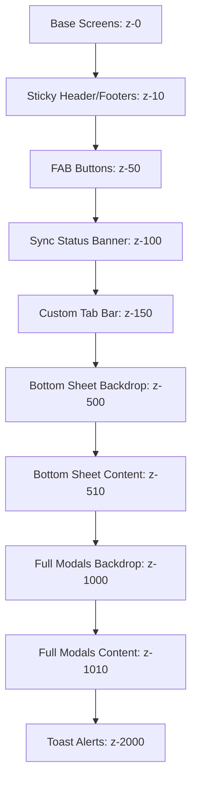

# KredBook Design System & Visual Specification (DESIGN.md)

> **KredBook** is a Bharat-first credit ledger (khata) app designed for kirana owners, traders, and small merchants in India. The design language is legible, warm, and financially trustworthy — premium enough for large wholesale businesses, yet simple and clear for daily quick transactions.

---

## 1. Design Philosophy

KredBook's primary interface uses a warm off-white canvas. Forest green anchors every successful action: it represents financial growth, cleared dues, and ledger health. The app is designed to feel like a trusted digital accountant's khata, avoiding unnecessary decorations.

### Core Design Pillars
1. **Speed & Efficiency**: Every key transaction (creating an entry or recording a payment) must be achievable in less than 30 seconds. Layouts are amount-first.
2. **Clarity Over Chrome**: Financial data is dense. Visual layouts prioritize high-contrast typography and clean alignments rather than illustrations and cards.
3. **₹ as a First-Class Citizen**: Rupee symbols are aligned as typographic entities. Amounts use tabular numbers to guarantee vertical column alignment.
4. **Thumb-Zone Accessibility**: Primary action buttons and navigation controls sit within the lower 72px of the screen to enable one-handed operation.
5. **A11y (Low-Connectivity & Low-Light)**: High-contrast state badges (exceeding WCAG AA contrast limits) and dynamic font scaling ensure readability on mid-range Android screens.

---

## 2. Brand Colors & Semantic Palettes

All color variables are declared in [src/utils/theme.ts](file:///c:/Users/Subrat/OneDrive/Desktop/kredBook/src/utils/theme.ts).

### 2.1 Primary & Brand Colors

| Token Name | Hex Code (Light) | Hex Code (Dark) | Intent & Usage |
| :--- | :--- | :--- | :--- |
| `primary` | `#16A34A` | `#22C55E` | Navigation elements, active tabs, brand icons, and paid states |
| `primaryDark` | `#15803D` | `#16A34A` | Button hover and pressed states |
| `primaryLight` | `#DCFCE7` | `#14532D` | Tinted borders, selection backgrounds, success chip fills |
| `heroBgStart` | `#15803D` | `#14532D` | Start value of dashboard summary card gradient |
| `heroBgEnd` | `#166534` | `#052E16` | End value of dashboard summary card gradient |

---

### 2.2 Neutral Canvas & Surfaces

| Token Name | Hex Code (Light) | Hex Code (Dark) | Intent & Usage |
| :--- | :--- | :--- | :--- |
| `canvas` | `#F9FAFB` | `#08111F` | Deep app-level container background |
| `surface` | `#FFFFFF` | `#122036` | Primary screen cards, modal panels, bottom sheets |
| `surfaceRaised` | `#F8FAFC` | `#1A2A43` | Sub-panels inside cards, inset fields, input boxes |
| `borderDefault` | `#E5E7EB` | `#31415D` | Card and divider outlines |
| `borderSubtle` | `#F3F4F6` | `#1F2937` | Inner hairline separators in list items |

---

### 2.3 Financial Semantic Colors (Strict Usage)

These palettes are reserved exclusively for signaling transaction states.

| Financial State | Indicator Tag | Surface BG (Light) | Surface BG (Dark) | Text Color (Light) | Text Color (Dark) |
| :--- | :--- | :--- | :--- | :--- | :--- |
| **Paid / Settled** | `paid` | `#DCFCE7` | `#14532D` | `#15803D` | `#86EFAC` |
| **Partially Paid** | `partial` | `#DBEAFE` | `#1E3A8A` | `#2563EB` | `#93C5FD` |
| **Pending / Due** | `pending` | `#FEF3C7` | `#4A3411` | `#D97706` | `#FCD34D` |
| **Overdue** | `overdue` | `#FEE2E2` | `#4C1D1D` | `#DC2626` | `#FCA5A5` |

---

### 2.4 Semantic Token Map (`useTheme()`)

React Native components query theme configurations dynamically via the `useTheme()` hook, resolving tokens from [src/utils/theme.ts](file:///c:/Users/Subrat/OneDrive/Desktop/kredBook/src/utils/theme.ts).

```typescript
import { useTheme } from "@/src/theme/useTheme";
const t = useTheme();

// Example Usage:
// <View style={{ backgroundColor: t.colors.surface }} />
// <Text style={{ color: t.colors.ink }}>Hello</Text>
```

#### Color Tokens Map

| `t.colors.[key]` | Light Mode Value | Dark Mode Value | Operational Target |
| :--- | :--- | :--- | :--- |
| `canvas` | `#F9FAFB` | `#08111F` | Page container background |
| `surface` | `#FFFFFF` | `#122036` | Card container background |
| `surfaceRaised` | `#F8FAFC` | `#1A2A43` | Inner cards, table panels, skeleton bases |
| `border` | `#E5E7EB` | `#31415D` | Card border lines |
| `borderLight` | `#F1F5F9` | `#24334D` | Softer inner-card dividers |
| `ink` | `#111827` | `#F3F4F6` | Primary header text, large amounts, customer names |
| `body` | `#374151` | `#D1D5DB` | Primary body paragraph copy, field labels |
| `muted` | `#6B7280` | `#B4C0D4` | Captions, secondary timestamps |
| `faint` | `#9CA3AF` | `#6B7280` | Placeholders, inactive selectors |
| `successBg` | `#F0FDF4` | `#0F2A1A` | "You Receive" credit summary card background |
| `dangerBg` | `#FEF2F2` | `#3A1118` | "You Owe" debit summary card background |
| `warningBg` | `#FFFBEB` | `#3A2A0E` | Pending alerts panel background |

---

## 3. NativeWind Integration & CSS Variable Schema

KredBook uses Tailwind CSS v3 and NativeWind v4 to handle layout configurations. Theme toggling is configured using CSS variable mappings declared in [global.css](file:///c:/Users/Subrat/OneDrive/Desktop/kredBook/global.css) and registered in [tailwind.config.js](file:///c:/Users/Subrat/OneDrive/Desktop/kredBook/tailwind.config.js).

### Variable Declarations Example
```css
/* global.css */
:root {
  --color-canvas: #F9FAFB;
  --color-surface: #FFFFFF;
  --color-ink: #111827;
  --color-border-default: #E5E7EB;
}

.dark {
  --color-canvas: #08111F;
  --color-surface: #122036;
  --color-ink: #F3F4F6;
  --color-border-default: #31415D;
}
```

### Tailwind Configurations Map
```javascript
// tailwind.config.js
module.exports = {
  theme: {
    extend: {
      colors: {
        canvas: "var(--color-canvas)",
        surface: "var(--color-surface)",
        ink: "var(--color-ink)",
        "border-default": "var(--color-border-default)",
      }
    }
  }
}
```

### Styling Rules
1. **Utility-Driven Layouts**: Use Tailwind utility classes (`className`) for padding (`p-4`), margin (`mb-3`), flex alignments (`flex-row items-center justify-between`), radius, and typography styles.
2. **Theme-Hook Shadows & Actions**: Style props are mandatory when handling shadows (`shadowColor`, elevation values), dynamic animated styles (e.g. layout transitions), and rgba color adjustments.
3. **No hardcoded Hex Values**: All custom inline colors must be resolved from `t.colors.*`.

---

## 4. Typography Scale

Fonts are loaded asynchronously at start:
- Display/Headings: `Plus Jakarta Sans` (`PlusJakartaSans_600SemiBold`, `PlusJakartaSans_700Bold`, `PlusJakartaSans_800ExtraBold`).
- Body/UI/Data: `Inter` (`Inter_400Regular`, `Inter_500Medium`, `Inter_600SemiBold`, `Inter_700Bold`).

### Sizing and Weights Scale

| Typography Token | Font Family | Size (dp) | Weight | Line Height | Tracking | Purpose |
| :--- | :--- | :--- | :--- | :--- | :--- | :--- |
| `typography.heroAmount` | Inter | 36px | 800 | 42px | -0.5px | Core balance display on hero cards |
| `typography.screenTitle` | Plus Jakarta Sans | 24px | 700 | 30px | -0.3px | Page title headings |
| `typography.sectionTitle` | Plus Jakarta Sans | 18px | 700 | 24px | -0.2px | Summary cards group titles |
| `typography.cardTitle` | Plus Jakarta Sans | 16px | 600 | 22px | -0.1px | Customer names in list items |
| `typography.body` | Inter | 15px | 400 | 22px | 0 | Descriptions, primary body text |
| `typography.caption` | Inter | 12px | 500 | 16px | +0.1px | Timestamps, metadata info |
| `typography.label` | Inter | 11px | 700 | 14px | +0.5px | UPPERCASE kickers, category labels |

---

## 5. Spacing & Radius Tokens

### Spacing Scale

| Token Name | Sizing (dp) | Layout Implementation |
| :--- | :--- | :--- |
| `spacing.xs` | 4px | Small icon gaps, dense metadata spacing |
| `spacing.sm` | 8px | Inner component margins, badge paddings |
| `spacing.md` | 12px | Input vertical pad, card element gaps |
| `spacing.lg` | 16px | Horizontal screen paddings, standard card margins |
| `spacing.xl` | 20px | Tablet layout margins |
| `spacing.screenPadding`| 16px | Standard horizontal margin |
| `spacing.sectionGapMd` | 16px | Vertical spacing between sections |
| `spacing.sectionGapLg` | 24px | Spacious section separations |

### Border Radius Scale

| Token Name | Radius (dp) | Target UI Element |
| :--- | :--- | :--- |
| `radius.xs` | 4px | Status progress fills |
| `radius.sm` | 8px | Selection radios, check indicators |
| `radius.md` | 12px | Text inputs, search fields |
| `radius.lg` | 16px | Entry buttons, action controls |
| `radius.xl` | 20px | Standard card outlines, list card containers |
| `radius.full` | 9999px | Circle buttons, status badges, avatars |

---

## 6. Component Visual Specifications

### 6.1 Buttons
* **Primary Button**:
  - Background: `t.colors.primary` (`#16A34A` / `#22C55E`).
  - Text: `t.colors.surface` (`#FFFFFF`), Bold, 15px.
  - Border Radius: `14px`, Height: `56px`.
  - Elevation: Shadow matching primary tint.
* **Secondary Button**:
  - Background: Transparent. Border: `1.5px` solid `t.colors.borderDefault`.
  - Text: `t.colors.body` (`#374151` / `#D1D5DB`).
  - Height: `50px`.
* **Destructive Button**:
  - Background: `t.colors.danger` (`#DC2626`). Sizing matches Primary.

---

### 6.2 Customer Ledger List Rows
- Height: `76px` virtualized container.
- Divider: `1px` solid `t.colors.borderSubtle` at bottom.
- Left Element: `40px` circular avatar. Background color resolved deterministically using a hash of the customer's name string from the avatar palette:
  - Colors: Calm blue (`#5B7CFA`), Calm purple (`#7C5BD6`), Magenta (`#C2417A`), Teal (`#0F9FA8`), Amber (`#D97706`), Slate (`#64748B`).
- Central Element: Customer name (16dp bold) and last transaction date (12dp muted).
- Right Element: Customer balance in tabular format. Uses semantic colors matching outstanding states (Paid/Overdue/Pending).

---

### 6.3 Standard Cards
- Background: `t.colors.surface` (`#FFFFFF` / `#122036`).
- Border: `1px` solid `t.colors.border` (`#E5E7EB` / `#31415D`).
- Radius: `16px`. Internal Padding: `16px`.
- Elevation: Warm-tinted shadow offset.

---

### 6.4 Status Badges

| Badge Status | Background (Light) | Background (Dark) | Text Color (Light) | Text Color (Dark) |
| :--- | :--- | :--- | :--- | :--- |
| **Paid** | `#DCFCE7` | `#14532D` | `#15803D` | `#86EFAC` |
| **Pending** | `#FEF3C7` | `#4A3411` | `#D97706` | `#FCD34D` |
| **Partially Paid**| `#DBEAFE` | `#1E3A8A` | `#2563EB` | `#93C5FD` |
| **Overdue** | `#FEE2E2` | `#4C1D1D` | `#DC2626` | `#FCA5A5` |

---

### 6.5 Form Inputs
- Background: `t.colors.surface` (`#FFFFFF` / `#122036`).
- Border: `1.5px` solid `t.colors.border` (`#E5E7EB` / `#31415D`).
- Focused State: Border changes to `t.colors.primary` (`#16A34A` / `#22C55E`), with a 3px soft focus ring.
- Error State: Border changes to `t.colors.danger` (`#DC2626`), with error text below in 12px red.

---

### 6.6 Skeleton Loaders
- Base Color: `t.colors.surfaceRaised` (`#F8FAFC` / `#1A2A43`).
- Animation: Shimmer gradient moving left-to-right over 1500ms.
- Skeletons must mirror the exact layout of the real component: circular avatar, name line, and right-aligned amount box.

---

## 7. Icons & Iconography

- **Library**: `lucide-react-native`.
- **Styling**: 1.5px stroke weight, consistent geometric styling.
- **Sizes**: Screen title actions: 24px, default body actions: 20px, inline list markers: 16px.
- **Touch Target**: Sized to a minimum of **44 x 44 dp** (iOS) and **48 x 48 dp** (Android).
- **Rule**: Stroke icons only. Do not mix filled and outlined styles.

---

## 8. Motion & UI Transitions

- **Micro-interactions**: Hover effects and selector updates complete in `120ms` (standard ease).
- **Page Transitions**: Slide transitions take `250ms` (standard easing).
- **Bottom Sheets**: Slide-up transition uses standard spring settings: `springConfig.default` (`stiffness 200, damping 20`).
- **Reduced Motion**: If user enables system-level reduced motion, transitions disable instantly (fallback to cross-fade).

---

## 9. Accessibility & Inclusivity

- **Color Contrast Standards**:
  - Normal text: Minimum contrast ratio of **4.5:1** against the background.
  - Large text (≥ 18dp): Minimum contrast ratio of **3.0:1**.
  - All status badge colors exceed these guidelines (e.g. Paid badge is 5.8:1 contrast).
- **Dynamic Text Scaling**:
  - All text tags enable `allowFontScaling={true}`.
  - Layout grids do not use hardcoded heights. Containers wrap dynamic content.
- **Screen Readers**:
  - Graphic-only buttons must specify `accessibilityLabel` details.
  - Interactive components must assign `accessibilityRole` and `accessibilityState`.

---

## 10. Do's and Don'ts

| Do | Don't |
| :--- | :--- |
| **Do** use `t.colors` for all layouts. | **Don't** write raw hex values inside CSS or style attributes. |
| **Do** use tabular numbers (`"tnum"`) for financial listings. | **Don't** left-align amounts or mix text and amounts in the same node. |
| **Do** enforce minimum touch target sizes. | **Don't** place action buttons below 44dp in size. |
| **Do** show descriptive empty state widgets with CTAs. | **Don't** show a blank screen or plain "No data found". |
| **Do** use stroke-based icons consistently. | **Don't** mix filled and stroke icon variations. |

---

## 11. Shadow & Elevation Tokens

To prevent hardcoded drop shadows and elevation inconsistencies across iOS, Android, and Web platforms, KredBook defines a unified multi-platform shadow token contract.

### 11.1 Platform Implementation Rule
- **iOS & Web**: Shadows are configured using explicit properties (`shadowColor`, `shadowOffset`, `shadowRadius`, `shadowOpacity`).
- **Android**: Shadows are driven by the OS-native `elevation` property.
- **Dark Mode**: All surfaces become flat or utilize black, low-opacity shadows (to avoid glowing light halos in dark backgrounds).

### 11.2 Unified Shadow Tokens

| Token Name | Light Mode (iOS/Web) | Light Mode (Android) | Dark Mode (iOS/Web/Android) | Visual Target |
| :--- | :--- | :--- | :--- | :--- |
| `shadow.button` | `shadowColor: "#16A34A"`,<br>`shadowOffset: { width: 0, height: 4 }`,<br>`shadowRadius: 8`,<br>`shadowOpacity: 0.20` | `elevation: 4` | `shadowOpacity: 0`,<br>`elevation: 0` | Primary action buttons |
| `shadow.card` | `shadowColor: "#1F2937"`,<br>`shadowOffset: { width: 0, height: 2 }`,<br>`shadowRadius: 6`,<br>`shadowOpacity: 0.06` | `elevation: 2` | `shadowColor: "#000000"`,<br>`shadowOffset: { width: 0, height: 4 }`,<br>`shadowRadius: 8`,<br>`shadowOpacity: 0.25`,<br>`elevation: 4` | Screen cards, modal surfaces |
| `shadow.fab` | `shadowColor: "#16A34A"`,<br>`shadowOffset: { width: 0, height: 6 }`,<br>`shadowRadius: 12`,<br>`shadowOpacity: 0.30` | `elevation: 6` | `shadowColor: "#000000"`,<br>`shadowOffset: { width: 0, height: 4 }`,<br>`shadowRadius: 8`,<br>`shadowOpacity: 0.30`,<br>`elevation: 5` | Floating Action Buttons (FAB) |
| `shadow.sheet` | `shadowColor: "#111827"`,<br>`shadowOffset: { width: 0, height: -6 }`,<br>`shadowRadius: 16`,<br>`shadowOpacity: 0.08` | `elevation: 16` | `shadowColor: "#000000"`,<br>`shadowOffset: { width: 0, height: -4 }`,<br>`shadowRadius: 12`,<br>`shadowOpacity: 0.40`,<br>`elevation: 12` | Bottom sheets |
| `shadow.destructive` | `shadowColor: "#DC2626"`,<br>`shadowOffset: { width: 0, height: 4 }`,<br>`shadowRadius: 8`,<br>`shadowOpacity: 0.15` | `elevation: 3` | `shadowOpacity: 0`,<br>`elevation: 0` | Destructive primary buttons |

---

## 12. Z-Index & Layering Contract

To resolve overlapping layout conflicts (such as bottom sheets hiding toasts, or FAB buttons floating above modal menus), the app uses a strict vertical index (`z-index`) hierarchy. All interactive layering containers must strictly inherit from these designated ranges.



### Layering Levels Detail

| Z-Index Value | Layer Identifier | Purpose | Overlay Behavior |
| :--- | :--- | :--- | :--- |
| `0` | `z-base` | Default views, lists, scroll panes, dashboard body. | Bottom layer of all screens. |
| `10` | `z-sticky` | Inline sticky sections, table section headers. | Stays above lists but below FABs. |
| `50` | `z-fab` | Floating Action Buttons (e.g. Add Transaction, Add Customer). | Must overlay sticky content. |
| `100` | `z-sync-banner` | SyncStatusBanner indicating offline queue status. | Placed under tab bars and sheets. |
| `150` | `z-tab-bar` | Custom Tab Navigation Bar. | Stays above screen contents. |
| `500` | `z-sheet-backdrop`| Semi-transparent dark overlay for bottom sheets. | Opacity `0.4` black. |
| `510` | `z-sheet-content` | Bottom sheet drawers (e.g. Customer Picker). | Slides up over Tab Bar. |
| `1000` | `z-modal-backdrop`| Semi-transparent backdrop for dialogs and full modals. | Opacity `0.5` black. |
| `1010` | `z-modal-content` | Full-screen modals, native alert dialogues. | Must cover Bottom Sheets. |
| `2000` | `z-toast` | Toast alerts, error notifications. | Always top of layout hierarchy. |

---

## 13. Bottom Sheet Snap Points

Snap points represent the percentage of screen height (or fixed heights in dp) that a bottom sheet occupies. To avoid layout shifts and guarantee proper thumb-zone usability, sheet snapping must map to the token definitions in [src/utils/theme.ts](file:///c:/Users/Subrat/OneDrive/Desktop/kredBook/src/utils/theme.ts).

### 13.1 Snap Configurations

| Sheet Type | Snap Point List | Token Map | Intent & Content Strategy |
| :--- | :--- | :--- | :--- |
| **Customer Picker** | `["90%"]` | `spacing.sheets.snapCustomer` | Maximum vertical list display to facilitate searching and scrolling customers. |
| **Record Payment** | `["65%"]` | `spacing.sheets.snapPayment` | Form focused. Keeps input keys and quick currency buttons in the bottom active thumb-zone. |
| **Category Selector**| `["50%"]` | `spacing.sheets.snapCategory` | Filter sheets, transaction category picker (Cash, Online, UPI). |
| **Full Page Sheet** | `["95%"]` | `spacing.sheets.snapFull` | Complex configuration panels, details form sheets. |

### 13.2 Interactive Physics
- Sheets utilize React Native Reanimated and Gesture Handler for spring-driven movement.
- Spring properties are strictly locked to `stiffness: 200, damping: 20, mass: 1` (`motion.springConfig.default`) to ensure natural tactile response and low-latency interaction.

---

## 14. Empty State Visual Spec

Every empty screen or listing (e.g. search result, customer transaction history, net balance reports) must render a structured empty state. Blank states are forbidden.

### 14.1 Visual Structure
- **Container**: Vertically and horizontally centered stack (`flex-col items-center justify-center`). Vertical spacing: `spacing.xl` (20dp).
- **Illustration/Icon**:
  - Size: `64px` x `64px` container.
  - Sizing: Centered circular background using `t.colors.surfaceRaised` with a 24px inner Lucide icon.
  - Stroke: Stroke-based icon with `1.5px` stroke width, color: `t.colors.muted`.
- **Typographic Stack**:
  - **Title**: `typography.cardTitle` (16px), Bold, in `t.colors.ink` with a bottom margin of `spacing.xs` (4px).
  - **Body**: `typography.body` (15px), Regular, center-aligned, in `t.colors.muted` to explain *why* the list is empty.
- **Action CTA**:
  - Centered below the text stack with a margin-top of `spacing.lg` (16px).
  - Use a Primary or Secondary button (height `50px` or compact `44px`) to guide the user to the next logical path (e.g., "Add Customer").

```
+------------------------------------------+
|                                          |
|                  (Icon)                  | <-- 64x64px Circle with 24px Lucide Icon
|                                          |
|               No Customers               | <-- Title (16px, Bold, Ink)
|       Tap the button below to start      | <-- Body (15px, Regular, Muted)
|            recording credits.            |
|                                          |
|            [ + Add Customer ]            | <-- CTA Button (Primary/Secondary, 50px)
|                                          |
+------------------------------------------+
```

---

## 15. Tab Bar Visual Spec

The bottom Tab Bar is the main navigation container. It hosts the 4 primary tabs: **Dashboard**, **People** (Customers), **Entries** (Transaction Log), and **Profile**.

### 15.1 Dimensional Specs
- **Height**: `64px` (with standard device bottom safe area insets applied dynamically).
- **Background**: `t.colors.surface` (`#FFFFFF` / `#122036`).
- **Border**: `1px` solid `t.colors.border` (`#E5E7EB` / `#31415D`) at the top edge.
- **Top Padding**: `4px` (`spacing.xs`) to balance the vertical label alignment.

### 15.2 State Styling
- **Active State**:
  - Icon & Text Color: `t.colors.primary` (`#16A34A` / `#22C55E`).
  - Label Font: `12px` (`typography.caption`), Bold.
- **Inactive State**:
  - Icon & Text Color: `t.colors.muted` (`#6B7280` / `#B4C0D4`).
  - Label Font: `12px` (`typography.caption`), Regular.

### 15.3 Notification Badge Spec
Used to display critical sync statuses, offline item counts, or system alerts.
- **Background**: `t.colors.danger` (`#DC2626` / `#EF4444`).
- **Text**: `t.colors.surface` (`#FFFFFF`), `10px` bold, centered.
- **Shape & Sizing**: Minimum size `18px` x `18px` (perfect circle). If value > 9, container expands to capsule shape (horizontal padding: `4px`).
- **Position**: Absolute layout positioned relative to the parent icon: `top: -2px`, `right: -6px`.

---

## 16. One-Time Screens Spec

One-time screens represent screens that are not visited regularly but are critical for key workflows (such as authentication or password recoveries). They must follow strict layout guidelines to reduce transaction drop-offs.

### 16.1 OTP (One-Time Password) Input Fields
- **Container**: Horizontal row containing 4 or 6 individual digit fields.
- **Digit Box Size**: Width: `48px`, Height: `56px`. Border radius: `radius.md` (12px).
- **Typography**: `typography.screenTitle` (24px bold) centered inside each box.
- **Interactive Visual States**:
  - *Default/Empty State*: Border `1.5px` solid `t.colors.border`.
  - *Focused State*: Border `2px` solid `t.colors.primary`.
  - *Filled State*: Border `1.5px` solid `t.colors.ink`.
  - *Error State*: Border `2px` solid `t.colors.danger` (displays error message below row in 12dp red).
- **Keyboard Handling**: Triggers native `number-pad` keyboard. Focused on the first empty box automatically.

### 16.2 Phone Number Field with Country Selection
- **Left Dropdown (Country Selector)**:
  - Width: `80px`. Contains country flag emoji (🇮🇳) and calling code (`+91`).
  - Divided from input field by a vertical hairline `1px` border `t.colors.border`.
- **Right Input (Phone Field)**:
  - Height: `50px` (matching `spacing.inputHeight`).
  - Typography: `typography.body` (15px), tabular numbers (`"tnum"`).
- **Error Indicator**: A red exclamation icon on the right edge of the input box when the number validation fails (< 10 digits or contains symbols).

### 16.3 Password Strength Indicator
To guide the user in setting strong credentials, a real-time indicator bar is placed beneath the password input.

- **Indicator Bars**:
  - Horizontal track divided into 3 equal segments (bars) with `radius.xs` (4px) and height `4px`.
  - **Weak**: 1st segment colored Red (`#DC2626`).
  - **Medium**: 1st and 2nd segments colored Orange/Amber (`#F59E0B`).
  - **Strong**: All 3 segments colored Green (`#16A34A`).
- **Requirement Checklist**:
  - Below the progress bars, display checklist items: "At least 8 characters", "1 number", "1 symbol".
  - **Met rule**: Green check icon (`✓`) in `t.colors.success`. Text in `t.colors.body`.
  - **Unmet rule**: Gray circle icon or bullet (`•`) in `t.colors.muted`. Text in `t.colors.muted`.

---

*This document serves as the visual and interface design source of truth for KredBook. Any styling updates must modify this specification in the same commit.*
