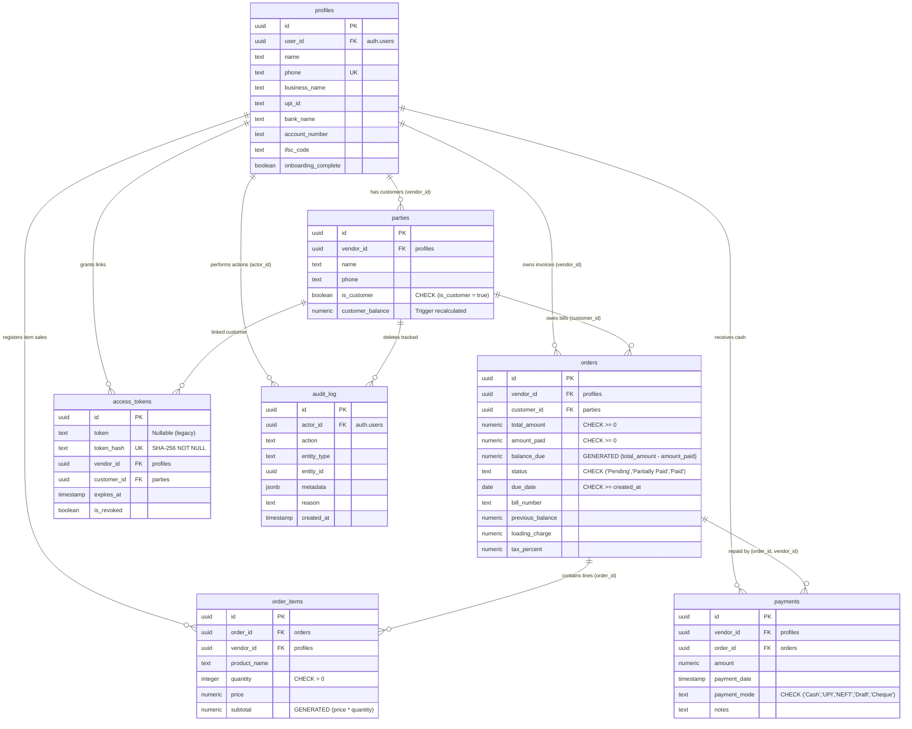

# KredBook Database Schema Specification (Schema.md)

> **KredBook** is a Bharat-first credit ledger (khata) app designed for kirana owners, traders, and small merchants in India. This document serves as the single source of truth for the Supabase/PostgreSQL database schema, triggers, security policies, indexes, and RPC interfaces.

---

## 1. Entity-Relationship Diagram (ERD)

The following Mermaid diagram shows the relational structure of the KredBook public schema, detailing primary/foreign keys, cardinalities, and constraints.



---

## 2. Table Specifications

### 2.1 public.profiles
Stores details of the logged-in merchant (vendor).

| Column Name | PG Type | Nullable | Default | Description / Constraint |
| :--- | :--- | :--- | :--- | :--- |
| `id` | `uuid` | NO | `gen_random_uuid()` | Primary Key |
| `user_id` | `uuid` | NO | | Foreign Key to `auth.users(id) ON DELETE CASCADE`. Unique. |
| `name` | `text` | NO | | User's full name. |
| `phone` | `text` | YES | | Merchant's phone number. Unique. |
| `created_at` | `timestamptz`| NO | `now()` | Registration timestamp. |
| `subscription_plan` | `text` | YES | `'free'` | Active pricing tier ('free' or 'premium'). |
| `subscription_expiry` | `date` | YES | | Expiry date for premium subscriptions. |
| `avatar_url` | `text` | YES | | Path to profile avatar inside Supabase bucket. |
| `business_logo_url` | `text` | YES | | Path to business logo inside Supabase bucket. |
| `business_name` | `text` | YES | | Registered shop / business name. |
| `billing_address` | `text` | YES | | Merchant business address. |
| `gstin` | `text` | YES | | GST identification number (15 chars). |
| `upi_id` | `text` | YES | | Virtual Payment Address (VPA) for UPI collections. |
| `bank_name` | `text` | NO | `''` | Registered bank name. |
| `account_number` | `text` | NO | `''` | Bank account number. |
| `ifsc_code` | `text` | NO | `''` | Bank IFSC code. |
| `bill_number_prefix` | `text` | YES | `'INV'` | Custom prefix for invoices (e.g. "INV-1002"). |
| `onboarding_complete`| `boolean` | NO | `false` | Tracks completion of registration pages. |

---

### 2.2 public.parties
Stores customer directories. Historical supplier functionalities have been completely deprecated; all records represent customers.

| Column Name | PG Type | Nullable | Default | Description / Constraint |
| :--- | :--- | :--- | :--- | :--- |
| `id` | `uuid` | NO | `gen_random_uuid()` | Primary Key |
| `vendor_id` | `uuid` | NO | | Foreign Key to `public.profiles(id) ON DELETE CASCADE`. |
| `name` | `text` | NO | | Customer's full name. |
| `phone` | `text` | YES | | Customer's mobile number. |
| `address` | `text` | YES | | Customer's physical address. |
| `is_customer` | `boolean` | NO | `false` | Must be `true` via `parties_is_customer_only` CHECK constraint. |
| `customer_balance` | `numeric` | NO | `0.00` | Recalculated outstanding balance via database triggers. |
| `bank_name` | `text` | YES | | Optional bank name for bank payouts. |
| `account_number` | `text` | YES | | Optional bank account number. |
| `ifsc_code` | `text` | YES | | Optional bank IFSC code. |
| `upi_id` | `text` | YES | | Optional customer UPI handle. |
| `created_at` | `timestamptz`| NO | `now()` | Timestamp of customer addition. |
| `updated_at` | `timestamptz`| NO | `now()` | Timestamp of last details update. |

**Constraints & Keys**:
* Primary Key: `parties_pkey (id)`
* Unique Composite Key: `parties_vendor_phone_unique (vendor_id, phone)` — prevents duplicate customer phone numbers under the same vendor.
* CHECK Constraint: `parties_is_customer_only CHECK (is_customer = true)`.

---

### 2.3 public.orders
Represents a transaction entry (invoice / credit bill).

| Column Name | PG Type | Nullable | Default | Description / Constraint |
| :--- | :--- | :--- | :--- | :--- |
| `id` | `uuid` | NO | `gen_random_uuid()` | Primary Key |
| `vendor_id` | `uuid` | NO | | Foreign Key to `public.profiles(id) ON DELETE CASCADE`. |
| `customer_id` | `uuid` | NO | | Foreign Key to `public.parties(id) ON DELETE CASCADE`. |
| `total_amount` | `numeric` | NO | | Total price of the invoice (pre-repayments). |
| `amount_paid` | `numeric` | NO | `0.00` | Cumulative amount paid on this entry. |
| `balance_due` | `numeric` | NO | | **GENERATED ALWAYS AS (total_amount - amount_paid) STORED**. |
| `status` | `text` | NO | `'Pending'` | Status of repayment. |
| `created_at` | `timestamptz`| NO | `now()` | Bill entry timestamp. |
| `due_date` | `date` | YES | `CURRENT_DATE+30` | Repayment due limit. |
| `bill_number` | `text` | YES | | Auto-generated or custom invoice identifier. |
| `previous_balance` | `numeric` | NO | `0.00` | Customer balance carried forward when creating the entry. |
| `loading_charge` | `numeric` | NO | `0.00` | Shipping/loading charges added to the bill. |
| `tax_percent` | `numeric` | NO | `0.00` | GST percentage applied to the order. |
| `edited_at` | `timestamptz`| YES | | Timestamp of last manual edit. |
| `edit_count` | `integer` | NO | `0` | Tracks number of manual edits for audit trails. |

**Constraints & Keys**:
* Primary Key: `orders_pkey (id)`
* Unique Composite Key 1: `orders_id_vendor_unique (id, vendor_id)` — required for composition foreign key constraints in `public.payments`.
* Unique Composite Key 2: `orders_vendor_bill_unique (vendor_id, bill_number)` — prevents duplicate bill numbers for the same vendor.
* CHECK Constraints:
  - `orders_total_amount_nonnegative CHECK (total_amount >= 0)`
  - `orders_amount_paid_nonnegative CHECK (amount_paid >= 0)`
  - `orders_amount_paid_lte_total CHECK (amount_paid <= total_amount)`
  - `orders_status_check CHECK (status IN ('Pending', 'Partially Paid', 'Paid'))`
  - `orders_due_date_reasonable CHECK (due_date IS NULL OR due_date >= created_at::date)`

---

### 2.4 public.order_items
Itemized rows for an invoice.

| Column Name | PG Type | Nullable | Default | Description / Constraint |
| :--- | :--- | :--- | :--- | :--- |
| `id` | `uuid` | NO | `gen_random_uuid()` | Primary Key |
| `order_id` | `uuid` | NO | | Foreign Key to `public.orders(id) ON DELETE CASCADE`. |
| `vendor_id` | `uuid` | NO | | Foreign Key to `public.profiles(id) ON DELETE CASCADE`. |
| `product_name` | `text` | NO | | Name of the product sold. |
| `price` | `numeric` | NO | | Unit rate of the product. |
| `quantity` | `integer` | NO | | Quantity of units sold. |
| `subtotal` | `numeric` | NO | | **GENERATED ALWAYS AS (price * quantity) STORED**. |
| `product_id` | `uuid` | YES | | Legacy column (transitional). |
| `variant_id` | `uuid` | YES | | Legacy column (transitional). |
| `created_at` | `timestamptz`| NO | `now()` | Creation timestamp. |

**Constraints & Keys**:
* Primary Key: `order_items_pkey (id)`
* CHECK Constraint: `order_items_quantity_check CHECK (quantity > 0)`.

---

### 2.5 public.payments
Represents payments recorded against specific invoices.

| Column Name | PG Type | Nullable | Default | Description / Constraint |
| :--- | :--- | :--- | :--- | :--- |
| `id` | `uuid` | NO | `gen_random_uuid()` | Primary Key |
| `vendor_id` | `uuid` | NO | | Foreign Key to `public.profiles(id) ON DELETE CASCADE`. |
| `order_id` | `uuid` | NO | | Composite Foreign Key to `public.orders(id, vendor_id)`. |
| `amount` | `numeric` | NO | | Amount of payment recorded. |
| `payment_date` | `timestamptz`| NO | `now()` | Timestamp when the payment was received. |
| `payment_mode` | `text` | NO | `'Cash'` | Selected mode of payment. |
| `notes` | `text` | YES | | Manual notes or remarks. |

**Constraints & Keys**:
* Primary Key: `payments_pkey (id)`
* Composite Foreign Key: `payments_order_vendor_fkey` targets `public.orders (id, vendor_id) ON DELETE CASCADE`. **This prevents cross-vendor payment tampering.**
* CHECK Constraint: `payments_payment_mode_check CHECK (payment_mode IN ('Cash', 'UPI', 'NEFT', 'Draft', 'Cheque'))`.

---

### 2.6 public.access_tokens
Stores sharing authorization links. Only SHA-256 hashes of tokens are stored in the database for defense-in-depth, preventing leak exposures.

| Column Name | PG Type | Nullable | Default | Description / Constraint |
| :--- | :--- | :--- | :--- | :--- |
| `id` | `uuid` | NO | `gen_random_uuid()` | Primary Key |
| `token` | `text` | YES | | Legacy token string (Nullable). |
| `token_hash` | `text` | NO | | **SHA-256 hash of raw token.** Unique. |
| `vendor_id` | `uuid` | NO | | Foreign Key to `public.profiles(id) ON DELETE CASCADE`. |
| `customer_id` | `uuid` | NO | | Foreign Key to `public.parties(id) ON DELETE CASCADE`. |
| `created_at` | `timestamptz`| YES | `now()` | Token creation timestamp. |
| `last_accessed_at`| `timestamptz`| YES | | Timestamp of last access. |
| `access_count` | `integer` | YES | `0` | Total accesses recorded. |
| `expires_at` | `timestamptz`| YES | | Expiry limit (optional). |
| `is_revoked` | `boolean` | YES | `false` | Revocation status flag. |

**Constraints & Keys**:
* Primary Key: `access_tokens_pkey (id)`
* Unique Hash Constraint: `access_tokens_token_hash_key UNIQUE (token_hash)`.

---

### 2.7 public.audit_log
Audit tracking database table for **Digital Personal Data Protection (DPDP) Act §9(3)** compliance. Logs all customer deletions with user actor info and metadata.

| Column Name | PG Type | Nullable | Default | Description / Constraint |
| :--- | :--- | :--- | :--- | :--- |
| `id` | `uuid` | NO | `gen_random_uuid()` | Primary Key |
| `actor_id` | `uuid` | NO | | ID of the authenticated user completing deletion. |
| `action` | `text` | NO | | Performed action identifier (e.g. `'customer_deleted'`). |
| `entity_type` | `text` | NO | | Type of audited row (`'party'`). |
| `entity_id` | `uuid` | NO | | Primary UUID of the deleted entity. |
| `metadata` | `jsonb` | YES | | Data snapshot of the deleted entity. |
| `reason` | `text` | YES | | Declared reason for deletion (optional). |
| `created_at` | `timestamptz`| YES | `now()` | Creation timestamp. |

---

## 3. Database Indexes

KredBook employs targeted indexing to optimize standard filters, join clauses, and background queries:

```sql
-- Profiles Unique Indexes
CREATE UNIQUE INDEX profiles_pkey ON public.profiles USING btree (id);
CREATE UNIQUE INDEX profiles_user_id_unique ON public.profiles USING btree (user_id);
CREATE UNIQUE INDEX profiles_phone_unique ON public.profiles USING btree (phone);

-- Parties Indexes
CREATE UNIQUE INDEX parties_pkey ON public.parties USING btree (id);
CREATE UNIQUE INDEX parties_vendor_phone_unique ON public.parties USING btree (vendor_id, phone);
CREATE INDEX idx_parties_vendor ON public.parties USING btree (vendor_id);
CREATE INDEX idx_parties_customer ON public.parties USING btree (vendor_id) WHERE (is_customer = true);
CREATE INDEX idx_parties_name ON public.parties USING btree (vendor_id, name);
CREATE INDEX idx_parties_phone ON public.parties USING btree (phone);

-- Orders Indexes
CREATE UNIQUE INDEX orders_pkey ON public.orders USING btree (id);
CREATE UNIQUE INDEX orders_id_vendor_unique ON public.orders USING btree (id, vendor_id);
CREATE UNIQUE INDEX orders_vendor_bill_unique ON public.orders USING btree (vendor_id, bill_number);
CREATE INDEX idx_orders_vendor ON public.orders USING btree (vendor_id);
CREATE INDEX idx_orders_customer ON public.orders USING btree (customer_id);
CREATE INDEX idx_orders_status ON public.orders USING btree (status);
CREATE INDEX idx_orders_created_at ON public.orders USING btree (created_at DESC);
CREATE INDEX idx_orders_vendor_balance_due ON public.orders USING btree (vendor_id, balance_due) WHERE (balance_due > 0);
CREATE INDEX idx_orders_vendor_due_date ON public.orders USING btree (vendor_id, due_date) WHERE (balance_due > 0);
CREATE INDEX orders_vendor_customer_idx ON public.orders USING btree (vendor_id, customer_id);

-- Order Items Indexes
CREATE UNIQUE INDEX order_items_pkey ON public.order_items USING btree (id);
CREATE INDEX idx_order_items_order ON public.order_items USING btree (order_id);
CREATE INDEX idx_order_items_variant ON public.order_items USING btree (variant_id);

-- Payments Indexes
CREATE UNIQUE INDEX payments_pkey ON public.payments USING btree (id);
CREATE INDEX idx_payments_vendor ON public.payments USING btree (vendor_id);
CREATE INDEX idx_payments_order ON public.payments USING btree (order_id);

-- Access Tokens Indexes
CREATE UNIQUE INDEX access_tokens_pkey ON public.access_tokens USING btree (id);
CREATE UNIQUE INDEX access_tokens_token_hash_key ON public.access_tokens USING btree (token_hash);
CREATE INDEX idx_access_tokens_customer ON public.access_tokens USING btree (customer_id);
CREATE INDEX idx_access_tokens_vendor ON public.access_tokens USING btree (vendor_id);
CREATE INDEX idx_access_tokens_token_hash ON public.access_tokens USING btree (token_hash);
CREATE INDEX idx_access_tokens_token ON public.access_tokens USING btree (token) WHERE (is_revoked = false);

-- Audit Log Indexes
CREATE UNIQUE INDEX audit_log_pkey ON public.audit_log USING btree (id);
```

---

## 4. PostgreSQL Stored Procedures & Triggers

### 4.1 sync_party_customer_balance()
Recalculates a customer's `customer_balance` automatically when invoice states or payment amounts change.

```sql
CREATE OR REPLACE FUNCTION public.sync_party_customer_balance()
RETURNS TRIGGER AS $$
BEGIN
  UPDATE public.parties
  SET customer_balance = COALESCE(
    (
      SELECT SUM(balance_due)
      FROM public.orders
      WHERE customer_id = COALESCE(NEW.customer_id, OLD.customer_id)
        AND LOWER(status) != 'paid'
    ),
    0
  )
  WHERE id = COALESCE(NEW.customer_id, OLD.customer_id);
  RETURN COALESCE(NEW, OLD);
END;
$$ LANGUAGE plpgsql;

-- Attached Trigger on Orders table
CREATE TRIGGER sync_customer_balance_on_order_change
  AFTER INSERT OR UPDATE OR DELETE ON public.orders
  FOR EACH ROW
  EXECUTE FUNCTION public.sync_party_customer_balance();
```

---

### 4.2 update_order_status()
Triggered after payments are made or modified. Updates the parent order's `amount_paid` and status flag.

```sql
CREATE OR REPLACE FUNCTION public.update_order_status()
RETURNS TRIGGER AS $$
BEGIN
  UPDATE orders
  SET amount_paid = (
        SELECT COALESCE(SUM(amount), 0)
        FROM payments p
        WHERE p.order_id = NEW.order_id
          AND p.vendor_id = orders.vendor_id
      ),
      status = CASE
        WHEN (
          SELECT COALESCE(SUM(amount), 0)
          FROM payments p
          WHERE p.order_id = NEW.order_id
            AND p.vendor_id = orders.vendor_id
        ) >= orders.total_amount THEN 'Paid'
        WHEN (
          SELECT COALESCE(SUM(amount), 0)
          FROM payments p
          WHERE p.order_id = NEW.order_id
            AND p.vendor_id = orders.vendor_id
        ) > 0 THEN 'Partially Paid'
        ELSE 'Pending'
      END
  WHERE id = NEW.order_id
    AND vendor_id = NEW.vendor_id;

  RETURN NULL;
END;
$$ LANGUAGE plpgsql;

-- Attached Trigger on Payments table
CREATE TRIGGER on_payment_upsert 
  AFTER INSERT OR UPDATE ON public.payments 
  FOR EACH ROW 
  EXECUTE FUNCTION public.update_order_status();
```

---

### 4.3 audit_party_delete()
DPDP Compliance trigger. Captures snapshots of customer records BEFORE they are dropped.

```sql
CREATE OR REPLACE FUNCTION public.audit_party_delete()
RETURNS TRIGGER
LANGUAGE plpgsql
SECURITY DEFINER
AS $$
BEGIN
  INSERT INTO public.audit_log (actor_id, action, entity_type, entity_id, metadata)
  VALUES (
    auth.uid(),
    'customer_deleted',
    'party',
    OLD.id,
    jsonb_build_object(
      'name', OLD.name,
      'phone', OLD.phone,
      'vendor_id', OLD.vendor_id,
      'customer_balance', OLD.customer_balance
    )
  );
  RETURN OLD;
END;
$$;

-- Attached Trigger on Parties table
CREATE TRIGGER trg_audit_party_delete
  BEFORE DELETE ON public.parties
  FOR EACH ROW
  EXECUTE FUNCTION public.audit_party_delete();
```

---

### 4.4 get_dashboard_summary()
Retrieves key operational stats for the merchant dashboard in a single query.

```sql
CREATE OR REPLACE FUNCTION public.get_dashboard_summary()
RETURNS TABLE(
  total_outstanding numeric,
  total_overdue numeric,
  overdue_customers_count bigint,
  top_overdue_customers jsonb,
  total_customers_count bigint,
  total_entries_count bigint
)
LANGUAGE sql
SECURITY DEFINER
SET search_path TO 'public'
AS $$
  WITH me AS (
    SELECT p.id AS vendor_id
    FROM public.profiles p
    WHERE p.user_id = auth.uid()
    LIMIT 1
  ),
  base AS (
    SELECT o.*
    FROM public.orders o
    JOIN me ON me.vendor_id = o.vendor_id
    WHERE o.balance_due > 0
  ),
  overdue AS (
    SELECT b.*
    FROM base b
    WHERE b.due_date IS NOT NULL
      AND b.due_date < CURRENT_DATE
  ),
  overdue_by_customer AS (
    SELECT
      o.customer_id,
      p.name,
      p.phone,
      SUM(o.balance_due) AS balance,
      MIN(o.due_date) AS oldest_due
    FROM overdue o
    JOIN public.parties p ON p.id = o.customer_id
    GROUP BY o.customer_id, p.name, p.phone
  ),
  top5 AS (
    SELECT *
    FROM overdue_by_customer
    ORDER BY balance DESC
    LIMIT 5
  )
  SELECT
    COALESCE((SELECT SUM(b.balance_due) FROM base b), 0) AS total_outstanding,
    COALESCE((SELECT SUM(o.balance_due) FROM overdue o), 0) AS total_overdue,
    COALESCE((SELECT COUNT(DISTINCT o.customer_id) FROM overdue o), 0) AS overdue_customers_count,
    COALESCE(
      (
        SELECT jsonb_agg(
          jsonb_build_object(
            'id', t.customer_id,
            'name', t.name,
            'phone', COALESCE(t.phone, ''),
            'balance', t.balance,
            'daysSince', GREATEST((CURRENT_DATE - t.oldest_due), 0)
          )
        )
        FROM top5 t
      ),
      '[]'::jsonb
    ) AS top_overdue_customers,
    COALESCE(
      (
        SELECT COUNT(*)
        FROM public.parties c
        JOIN me ON me.vendor_id = c.vendor_id
        WHERE c.is_customer = true
      ),
      0
    ) AS total_customers_count,
    COALESCE(
      (
        SELECT COUNT(*)
        FROM public.orders o
        JOIN me ON me.vendor_id = o.vendor_id
      ),
      0
    ) AS total_entries_count;
$$;
```

---

### 4.5 get_customer_full_detail(p_customer_id, p_vendor_id)
Consolidates two round-trips (customer order query and statement timeline extraction) into a single database RPC call.

```sql
CREATE OR REPLACE FUNCTION public.get_customer_full_detail(
  p_customer_id UUID,
  p_vendor_id UUID
)
RETURNS JSONB
LANGUAGE plpgsql
SECURITY DEFINER
SET search_path = 'public'
AS $$
DECLARE
  v_orders JSONB;
  v_statements JSONB;
  v_verified BOOLEAN;
BEGIN
  -- Verify this customer belongs to the calling vendor (defense-in-depth)
  SELECT EXISTS (
    SELECT 1 FROM parties
    WHERE id = p_customer_id
      AND vendor_id = p_vendor_id
      AND is_customer = TRUE
  ) INTO v_verified;

  IF NOT v_verified THEN
    RETURN jsonb_build_object(
      'orders', '[]'::JSONB,
      'statements', '[]'::JSONB
    );
  END IF;

  -- Orders (sorted ascending for client-side balance calculation)
  SELECT jsonb_agg(
    jsonb_build_object(
      'id', o.id,
      'created_at', o.created_at,
      'total_amount', o.total_amount,
      'amount_paid', o.amount_paid,
      'balance_due', o.balance_due,
      'status', o.status,
      'bill_number', o.bill_number,
      'due_date', o.due_date
    )
    ORDER BY o.created_at ASC
  )
  INTO v_orders
  FROM orders o
  WHERE o.customer_id = p_customer_id
    AND o.vendor_id = p_vendor_id;

  -- Statements (ledger: bills + payments with running balance)
  WITH combined_events AS (
    SELECT
      o.id,
      'bill' AS type,
      o.created_at,
      o.total_amount AS amount,
      o.bill_number,
      o.status,
      (SELECT count(*) FROM order_items oi WHERE oi.order_id = o.id) AS item_count,
      NULL::TEXT AS payment_mode,
      NULL::TEXT AS order_bill_number
    FROM orders o
    WHERE o.customer_id = p_customer_id
      AND o.vendor_id = p_vendor_id

    UNION ALL

    SELECT
      p.id,
      'payment' AS type,
      p.payment_date AS created_at,
      p.amount,
      NULL::TEXT AS bill_number,
      NULL::TEXT AS status,
      0::BIGINT AS item_count,
      p.payment_mode,
      o.bill_number AS order_bill_number
    FROM payments p
    JOIN orders o ON p.order_id = o.id AND o.vendor_id = p_vendor_id
    WHERE o.customer_id = p_customer_id
      AND o.vendor_id = p_vendor_id
  ),
  running AS (
    SELECT
      id, type, created_at, amount,
      SUM(CASE WHEN type = 'bill' THEN amount ELSE -amount END)
        OVER (ORDER BY created_at ASC, type ASC, id ASC) AS running_balance,
      bill_number, status, item_count, payment_mode, order_bill_number
    FROM combined_events
  )
  SELECT jsonb_agg(
    jsonb_build_object(
      'id', r.id,
      'type', r.type,
      'created_at', r.created_at,
      'amount', r.amount,
      'running_balance', r.running_balance,
      'bill_number', r.bill_number,
      'status', r.status,
      'item_count', r.item_count,
      'payment_mode', r.payment_mode,
      'order_bill_number', r.order_bill_number
    )
    ORDER BY r.created_at DESC
  )
  INTO v_statements
  FROM running r;

  RETURN jsonb_build_object(
    'orders', COALESCE(v_orders, '[]'::JSONB),
    'statements', COALESCE(v_statements, '[]'::JSONB)
  );
END;
$$;
```

---

## 5. Row Level Security (RLS) Policy Registry

Every table enforces RLS to ensure vendors can only view and manage their own data partitions.

| Target Table | Action | Policy Name | SQL Constraint (`USING` / `WITH CHECK`) |
| :--- | :--- | :--- | :--- |
| `access_tokens` | ALL | "Vendors manage own tokens" | `vendor_id IN (SELECT id FROM profiles WHERE user_id = auth.uid())` |
| `profiles` | SELECT | "Users can view own profile" | `auth.uid() = user_id` |
| `profiles` | INSERT | "Users can insert own profile" | `auth.uid() = user_id` |
| `profiles` | UPDATE | "Users can update own profile" | `auth.uid() = user_id` |
| `parties` | ALL | "Vendors can manage own parties" | `vendor_id IN (SELECT id FROM profiles WHERE user_id = auth.uid())` |
| `orders` | SELECT | "Vendors can view own orders" | `vendor_id IN (SELECT id FROM profiles WHERE user_id = auth.uid())` |
| `orders` | INSERT | "Vendors can insert own orders" | `vendor_id IN (SELECT id FROM profiles WHERE user_id = auth.uid())` |
| `orders` | UPDATE | "Vendors can update own orders" | `vendor_id IN (SELECT id FROM profiles WHERE user_id = auth.uid())` |
| `orders` | DELETE | "Vendors can delete own orders" | `vendor_id IN (SELECT id FROM profiles WHERE user_id = auth.uid())` |
| `order_items` | SELECT | "Vendors can view own order items" | `vendor_id IN (SELECT id FROM profiles WHERE user_id = auth.uid())` |
| `order_items` | INSERT | "Vendors can insert own order items"| `vendor_id IN (SELECT id FROM profiles WHERE user_id = auth.uid())` |
| `order_items` | UPDATE | "Vendors can update own order items"| `vendor_id IN (SELECT id FROM profiles WHERE user_id = auth.uid())` |
| `order_items` | DELETE | "Vendors can delete own order items"| `vendor_id IN (SELECT id FROM profiles WHERE user_id = auth.uid())` |
| `payments` | SELECT | "Vendors can view own payments" | `vendor_id IN (SELECT id FROM profiles WHERE user_id = auth.uid())` |
| `payments` | INSERT | "Vendors can insert own payments" | `vendor_id IN (SELECT id FROM profiles WHERE user_id = auth.uid())` |
| `payments` | UPDATE | "Vendors can update own payments" | `vendor_id IN (SELECT id FROM profiles WHERE user_id = auth.uid())` |
| `payments` | DELETE | "Vendors can delete own payments" | `vendor_id IN (SELECT id FROM profiles WHERE user_id = auth.uid())` |
| `audit_log` | SELECT | "vendors_can_select_own_audit" | `actor_id = auth.uid()` |

---

## 6. Storage Buckets Configuration

Supabase storage object limits are restricted using standard RLS buckets rules:

* **`avatars` (Public)**: Holds user and customer display photos.
  - *Read*: Allow select policy to `public` (anyone can view avatar assets).
  - *Manage*: Allow insert/delete policies to `authenticated` users only.
* **`business-logos` (Public)**: Holds merchant invoice/business logos.
  - *Read*: Allow select policy to `public`.
  - *Manage*: Allow insert/update/delete policies to `authenticated` users.

```sql
-- Storage RLS Enforcement
CREATE POLICY "Public read for public buckets" ON storage.objects FOR SELECT TO public
  USING ((bucket_id = ANY (ARRAY['avatars'::text, 'business-logos'::text])));

CREATE POLICY "Avatars upload" ON storage.objects FOR INSERT TO authenticated
  WITH CHECK ((bucket_id = 'avatars'::text));

CREATE POLICY "Avatars delete" ON storage.objects FOR DELETE TO authenticated
  USING ((bucket_id = 'avatars'::text));
```

---

## 7. Known Security & Schema Debt

During migration sweeps and audits, the following legacy definitions were kept for compatibility but are marked for refactoring:
1. **Duplicate RLS Policies**: Several tables have duplicate policy listings (e.g., `orders` has policies named both `Vendors can view own orders` and `select_own_orders` referencing identical checks). These must be cleaned up in a future consolidation pass.
2. **Transition Columns**: `order_items.product_id` and `order_items.variant_id` are redundant nullable UUIDs. These columns are kept solely to prevent breaking older database snapshots, and are bypassed in the current app logic.
3. **Trigger Recalculation Dependency**: The `customer_balance` trigger runs on a `SUM(balance_due)` over the orders table. Large databases may experience locks during high transaction volumes. A caching table or async cron reconciliation scheme is planned for scaling.
